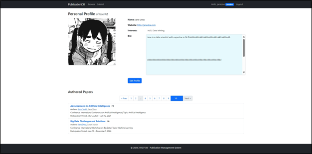
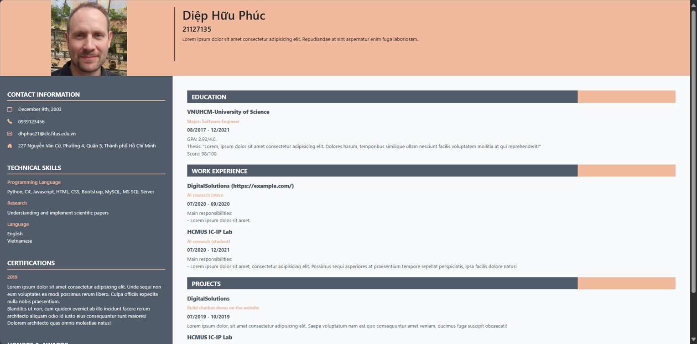
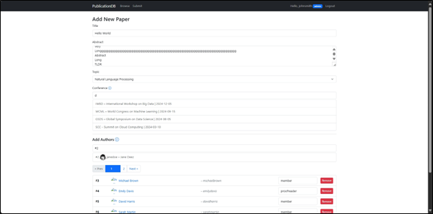
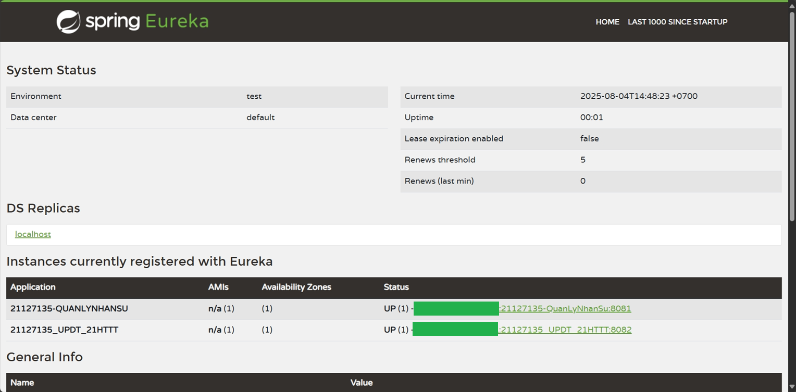

<a name="readme-top"></a>

# DApp - Collection

-   Collection of stuffs from HCMUS's 2025 Distributed Applications course.

<div align="center">
    
    
</div>
<div align="center">
    
    
</div>

## Getting Started

### Prerequisites

-   [`MAMP`](https://www.mamp.info/en/windows/) >= 5.0.6.

_For the BTTHs (Lab exercises):_

-   [`Eclipse IDE`](https://www.eclipse.org/downloads/) <= 2025-06 v4.36.0; and its [`Spring Tools`](https://marketplace.eclipse.org/content/spring-tools-aka-spring-tool-suite) <= 4.31.0.
-   [`Eclipse Temurin JDK 8`](https://adoptium.net/temurin/releases/?version=8).
-   [`MongoDB`](https://www.mongodb.com/).
-   [`Erlang/OTP 24`](https://www.erlang.org/downloads/24) and [`RabbitMQ 3.10`](https://www.rabbitmq.com/release-information).

### Installation

1. Clone the repo.

    ```console
    https://github.com/kru01/Dapp_Collection.git
    ```

#### BaiTap2_Publication

1. Run [`PublicationDB.sql`](./BaiTap2_Publication/PublicationDB.sql) to setup all the MySQL database and data.

1. Navigate to [`config/config.inc.php`](./BaiTap2_Publication/config/config.inc.php) and change things as needed.

    ```php
    define('BASE_URL', '/BaiTap2_Publication/');

    /* MYSQL
    */
    $host = 'localhost';
    $dbname = 'PublicationDB';
    $username = 'root';
    $password = 'root';

    $mysqli = new mysqli($host, $username, $password, $dbname);
    if ($mysqli->connect_error) {
        echo "Connection failed: " . $mysqli->connect_error;
        die("Connection failed: " . $mysqli->connect_error);
    }
    ```

    1. My PHP host is the default `htdocs` of MAMP so the _base_ index link is `http://localhost/BaiTap2_Publication/index.php`.

#### BTTHs (LabExs)

You should probably do fine following the guides in the attached docs for both installation and coding. However, for the Eclipse Marketplace to work properly, I did have to download a newer JDK and edit eclipse's `vm` to point to it.

-   E.g., with `D:\Tools\eclipse\java-2025-06\eclipse\eclipse.ini`,

    ```ini
    ...
    -vm
    D:/Tools/Eclipse Adoptium/jdk-21.0.8.9-hotspot/bin/javaw.exe
    -vmargs
    ...
    ```

In the IDE's `Preferences`, navigate to `Java`&rarr;`Installed JREs` and change it to **JDK 8**. As for the `pom.xml`s, I use the following versions:

```xml
...
<modelVersion>4.0.0</modelVersion>
<parent>
    <groupId>org.springframework.boot</groupId>
    <artifactId>spring-boot-starter-parent</artifactId>
    <version>2.7.18</version>
    <relativePath/> <!-- lookup parent from repository -->
</parent>
...
<properties>
    <java.version>1.8</java.version>
    <spring-cloud.version>2021.0.9</spring-cloud.version>
</properties>
...
```

## Usage

-   Read the docs (`.pdf`s) that come with each folder for contexts.
    -   [Ex1 - HTML and CSS basics](./BaiTap1_HTML-CSS/Bai%20tap%201.pdf).
    -   [Ex2 - Publication management system](./BaiTap2_Publication/docs/).
    -   [LabEx1 - Microservice basics](./BTTH1_Microservice/GioiThieuMicroservice.pdf).
    -   [LabEx2 - Business logic in Microservices](./BTTH2_CRUD/Business%20Logic%20In%20Microservices.pdf).
    -   [LabEx3 - Async communication in Microservices with RabbitMQ](./BTTH3_RabbitMQ/AsynchronousCommunication%20In%20Microservices.pdf).
