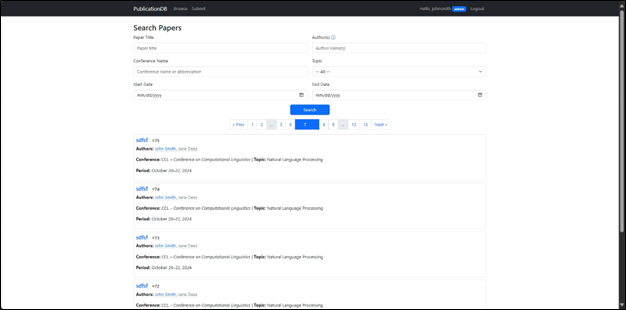

<a name="readme-top"></a>

# DApp - Collection

-   Collection of stuffs from HCMUS's 2025 Distributed Applications course.

<div align="center">
    
    
</div>
<div align="center">
    
    
</div>

## Getting Started

### Prerequisites

-   [`MAMP`](https://www.mamp.info/en/windows/) >= 5.0.6.

### Installation

1. Clone the repo.

    ```console
    https://github.com/kru01/Dapp_Collection.git
    ```

#### BaiTap2_Publication

1. Run [`PublicationDB.sql`](./BaiTap2_Publication/PublicationDB.sql) to setup all the MySQL database and data.

1. Navigate to [`config/config.inc.php`](./BaiTap2_Publication/config/config.inc.php) and change things as needed.

    ```php
    define('BASE_URL', '/BaiTap2_Publication/');

    /* MYSQL
    */
    $host = 'localhost';
    $dbname = 'PublicationDB';
    $username = 'root';
    $password = 'root';

    $mysqli = new mysqli($host, $username, $password, $dbname);
    if ($mysqli->connect_error) {
        echo "Connection failed: " . $mysqli->connect_error;
        die("Connection failed: " . $mysqli->connect_error);
    }
    ```

    1. My PHP host is the default `htdocs` of MAMP so the _base_ index link is `http://localhost/BaiTap2_Publication/index.php`.

## Usage

-   Read the docs (`.pdf`s) that come with each folder for contexts.
    -   [Ex1 - HTML and CSS basics](./BaiTap1_HTML-CSS/Bai%20tap%201.pdf).
    -   [Ex2 - Publication management system](./BaiTap2_Publication/docs/).
